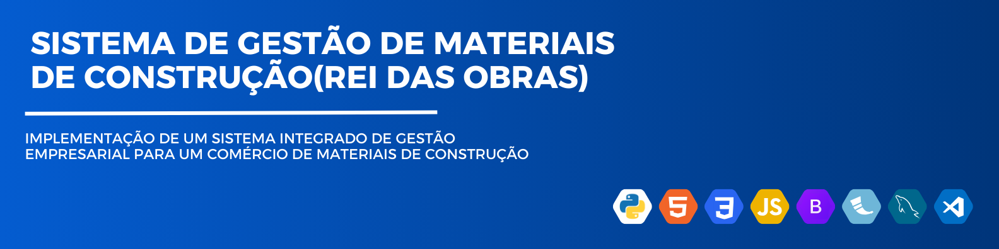

# Rei das Obras — Sistema Integrado de Gestão Empresarial

O Sistema Integrado de Gestão Empresarial foi desenvolvido em Python, tendo o framework Flask como base para a construção da aplicação web e criação das APIs. Para o mapeamento objeto-relacional, utiliza-se o SQLAlchemy, enquanto o MySQL atua como banco de dados principal, gerenciado por meio do MySQL Workbench. A aplicação adota uma arquitetura modular fundamentada em Blueprints do Flask, o que permite organizar as funcionalidades em módulos independentes, proporcionando maior clareza, escalabilidade e manutenção do código.

# Links

**Apresentação:**  
[https://drive.google.com/uc?export=view&id=1mVeJ2Gs79G71yY26x9Dt13xLKDLlmZLz](https://drive.google.com/uc?export=download&id=1keV5ywojnk0BfpeD-W28cL0EQ10NLRRj
)
